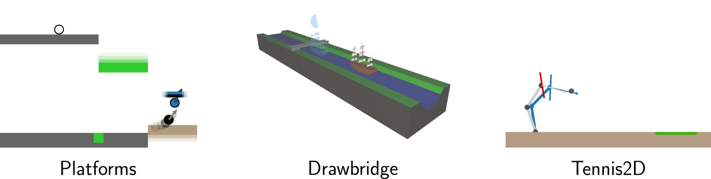

# Dynamic reinforcement learning benchmarks

This repository contains three open source reinforcement learning environments that require the agent to adapt its behavior to or make use of dynamic elements in the environment in order to solve the task. The environments follow OpenAI's gym interface.



## Installation

With python3.7 or higher run

```bash
pip install dyn_rl_benchmarks
```

## Usage 

After importing the package `dyn_rl_benchmarks` the environments

* Platforms-v1
* Drawbridge-v1
* Tennis2D-v1

are registered and can be instantiated via `gym.make`. 

The following example runs Platforms-v1 with randomly sampled actions:
```python
import gym

import dyn_rl_benchmarks

env = gym.make("Platforms-v1")

obs = env.reset()
done = False
while not done:
  action = env.action_space.sample()
  obs, rew, done, info = env.step(action)
  env.render()
```

## How to cite


```
@article{gurtler2021hierarchical,
  title={Hierarchical Reinforcement Learning with Timed Subgoals},
  author={G{\"u}rtler, Nico and B{\"u}chler, Dieter and Martius, Georg},
  journal={Advances in Neural Information Processing Systems},
  volume={34},
  year={2021}
}
```
